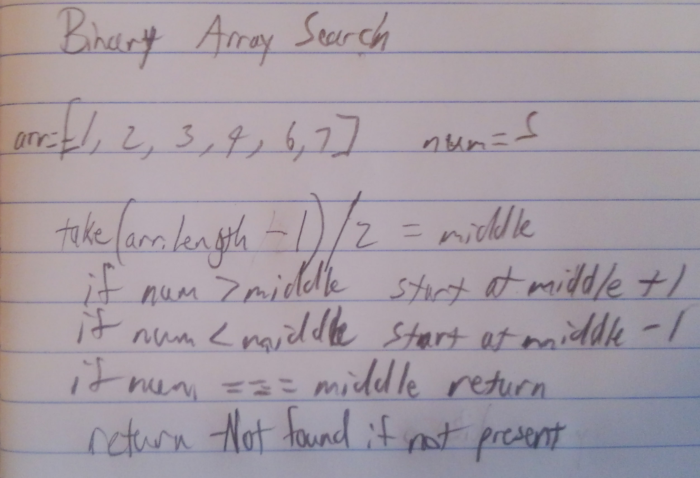

## Challenge 1: Reverse An Array
<!-- Short summary or background information -->

### Challenge
<!-- Description of the challenge -->
Write a function called reverseArray which takes an array as an argument. Without utilizing any of the built-in methods available to your language, return an array with elements in reversed order.

### Approach & Efficiency
<!-- What approach did you take? Why? What is the Big O space/time for this approach? -->

### Solution

