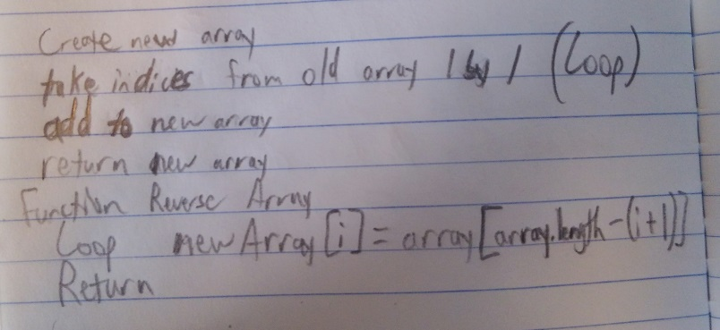

## Challenge 3: Binary Search in an Array
<!-- Short summary or background information -->

### Challenge
<!-- Description of the challenge -->
Write a function called BinarySearch which takes in 2 parameters: a sorted array and the search key. Without utilizing any of the built-in methods available to your language, return the index of the array’s element that is equal to the search key, or -1 if the element does not exist.

### Approach & Efficiency
<!-- What approach did you take? Why? What is the Big O space/time for this approach? -->

Create function {
Create new array
  (Loop){
  Take indices 1 by 1 from end of old array to beginning of new array}
Return new array
}

### Solution

