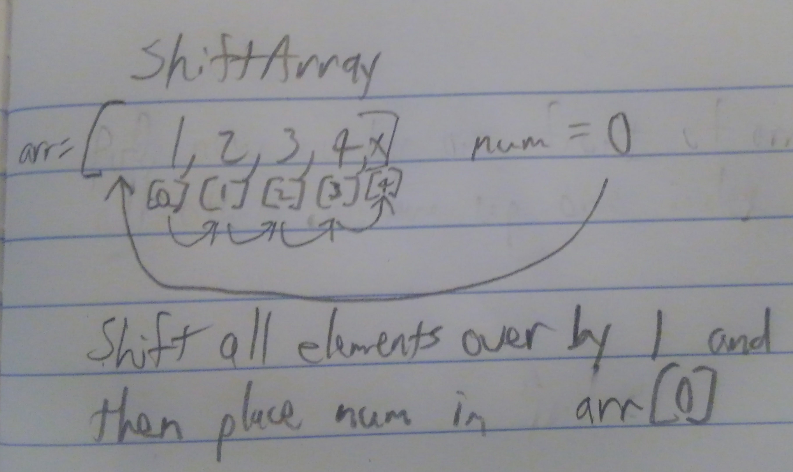

## Challenge 2: Shift An Array
<!-- Short summary or background information -->

### Challenge
<!-- Description of the challenge -->
Write a function called insertShiftArray which takes in an array and the value to be added. Without utilizing any of the built-in methods available to your language, return an array with the new value added at the middle index.

### Approach & Efficiency
<!-- What approach did you take? Why? What is the Big O space/time for this approach? -->

Create function {
Create new array
  (Loop){
  Take indices 1 by 1 from end of old array to beginning of new array}
Return new array
}

### Solution

