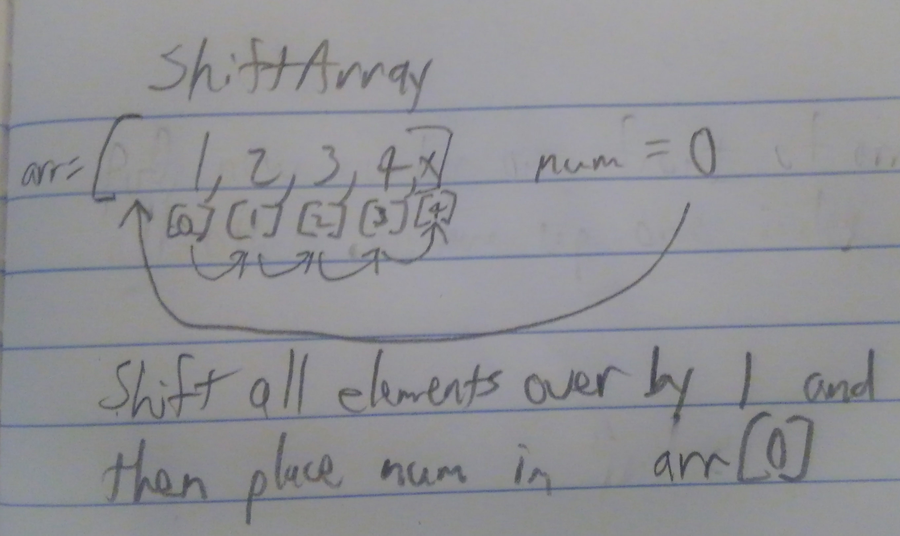

## Challenge 5: Linked Lists
<!-- Short summary or background information -->

### Challenge
<!-- Description of the challenge -->
Implement a Singly Linked List Data Structure

### Approach & Efficiency
<!-- What approach did you take? Why? What is the Big O space/time for this approach? -->

### Solution

