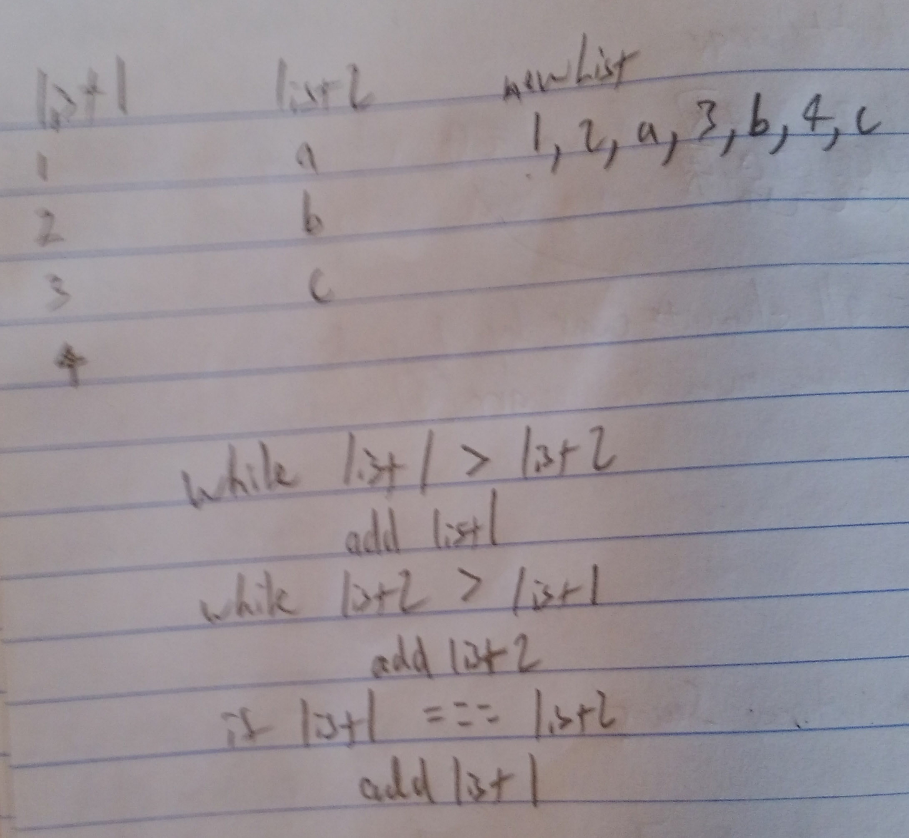

## Challenge 8: Merging Linked Lists
Merge Two Linked Lists

## Challenge Description
Write a function called mergeLists which takes two linked lists as arguments. Zip the two linked lists together into one so that the nodes alternate between the two lists and return a reference to the head of the zipped list. Try and keep additional space down to O(1). You have access to the Node class and all the properties on the Linked List class as well as the methods created in previous challenges.

## Approach & Efficiency
Using while loops and if statements, take the list that is longer and add a value to the start of a new list, continue added from the longer of the two lists, if lists both the same size take from the first list argument.  If one list is much longer just keep adding the values from that longer list until all values from original lists added to new list.

## Solution
