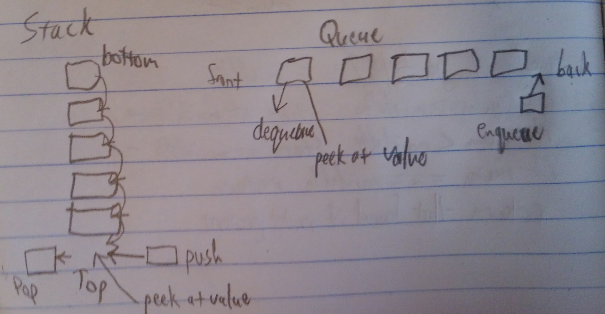

## Challenge 10: Stack and a Queue Implementation
Implement a Stack and a Queue Data Structure

## Challenge Description
- Create a Stack class that has a top property. It creates an empty Stack when instantiated.
This object should be aware of a default empty value assigned to top when the stack is created.

1. Define a method called push which takes any value as an argument and adds a new node with that value to the top of the stack with an O(1) Time performance.
2. Define a method called pop that does not take any argument, removes the node from the top of the stack, and returns the node’s value.
3. Define a method called peek that does not take an argument and returns the value of the node located on top of the stack, without removing it from the stack.

- Create a Queue class that has a front property. It creates an empty Queue when instantiated.
This object should be aware of a default empty value assigned to front when the queue is created.

1. Define a method called enqueue which takes any value as an argument and adds a new node with that value to the back of the queue with an O(1) Time performance.
2. Define a method called dequeue that does not take any argument, removes the node from the front of the queue, and returns the node’s value.
3. Define a method called peek that does not take an argument and returns the value of the node located in the front of the queue, without removing it from the queue.

## Approach & Efficiency
I created a node class that stores values for the node and a pointer to the next node. I created a stack class with a top property which makes an empty stack when instantiated. And then I created a queue class with a front property that instantiates an empty queue.

## Solution
